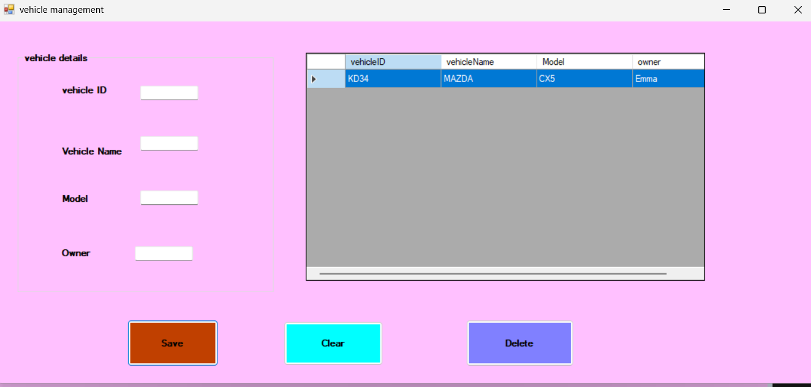

# Vehicle Management System

A simple Vehicle Management System built using **VB.NET** and **Windows Forms** in Visual Studio.

## Features
- Add vehicle details including Vehicle ID, Vehicle Name, Model, and Owner
- View all added vehicles in a data grid
- Delete selected vehicle records
- Clear input fields instantly

## How to Use
1. Enter the **Vehicle ID**, **Vehicle Name**, **Model**, and **Owner** in the input fields
2. Click **Save** to add the vehicle to the list
3. Click **Clear** to reset all input fields
4. Select a row in the table and click **Delete** to remove a vehicle record

## Screenshot

## Author
**Emma-culate** — Vehicle Management System project
